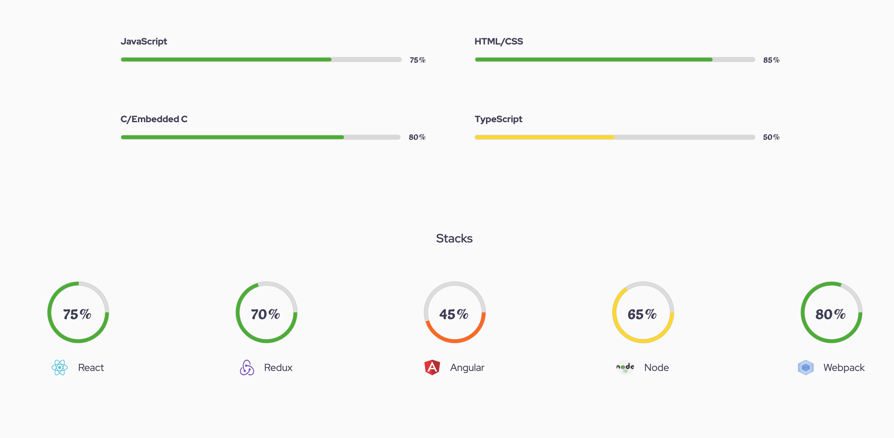
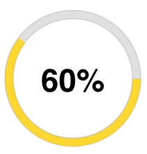
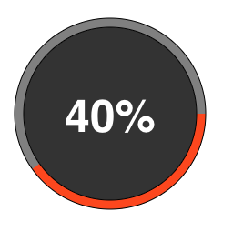

# react-animated-progress-bar

Animated progress bar using react

### Use case scenario


## Description

This package allows you to customize both circular and rectangular progress bar to various colors and sizes that suits your application or design.

- Progress bar animates when component is in view. By default it uses the document reference to check if component is in view or not. But you can pass the ref object which is scrollable to the scollArea props.abs

**For example**

```
const myRef = document.querySelector('.scrollable-div')

<ProgressBar width="230" trackWidth="13" percentage={score} scrollArea={myRef} />
```

**Otherwise**
if not defined it uses the document as the reference object

## Set up

To use package, Start of with

- npm i react-animated-progress-bar

on your react project file

### For a circular progress bar

```
import ProgressBar from 'react-animated-progress-bar';

<ProgressBar width="230" trackWidth="13" percentage="60" />
```

#### Output



### For a rectangular progress bar

set the rect props on the component to true

```
import ProgressBar from 'react-animated-progress-bar';

<ProgressBar
        width="400px"
        height="10px"
        rect
        fontColor="gray"
        percentage="70"
        rectPadding="1px"
        rectBorderRadius="20px"
        trackPathColor="transparent"
        bgColor="#333333"
        trackBorderColor="grey"
      />
```

#### Output


## Properties and description

- width (must be a string): width of the progressbar in rectangle type and diameter for circular type,

- percentage (must be a string): percentage of the progress bar

- height (must be a string): height for rectangular bar. Needed only in rectangular type

- rectPadding (must be a string): Padding around rectangular bar,

- trackBorderColor (must be a string): Border color of the track

- fontColor (must be a string): Percent font color

- rectBorderRadius (must be a string): border radius of rectangular bar

- trackPathColor (must be a string): color of the track path

- hollowBackgroundColor (must be a string): required only in circular bar. it gives the background color of the circle

- scrollArea (must be a dom element): the scrollable area. By default it is document

- defColor (must be an object); defines custom color for each level of the percentage ( fair )


### Use case for the props in circular mode
````
const myRef = document.querySelector('.scrollable-div')

<ProgressBar
          width="500px"
          height="10px"
          fontColor="white"
          trackWidth="10"
          percentage="40"
          trackPathColor="grey"
          trackBorderColor="black"
          hollowBackgroundColor="#333333"
          defColor={{
            fair: 'orangered',
            good: 'yellow',
            excellent: 'green',
            poor: 'red',
          }}
          scrollArea={myAppRef}
        />
````

### output

